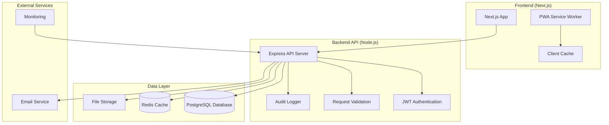

# Design Document

## Overview

This design document outlines the architecture for implementing a complete backend system for CrediCheck, separating it from the existing Next.js frontend. The backend will be built as a standalone Node.js/Express API server with PostgreSQL database, JWT authentication, comprehensive testing, and PWA capabilities. The system will maintain the existing Spanish localization and Colombian compliance requirements while providing real data persistence and security.

## Architecture

### High-Level Architecture



### Technology Stack

**Backend Framework:**
- Node.js 20+ with Express.js 4.18+
- TypeScript for type safety
- Helmet for security headers
- CORS for cross-origin requests

**Database & Caching:**
- PostgreSQL 15+ for primary data storage
- Redis 7+ for session management and caching
- Prisma ORM for database operations

**Authentication & Security:**
- JWT tokens with refresh token rotation
- bcrypt for password hashing
- Rate limiting with express-rate-limit
- Input validation with Zod

**Testing Framework:**
- Jest for unit testing
- Supertest for API integration testing
- Playwright for E2E testing
- Artillery for load testing

**DevOps & Monitoring:**
- Docker for containerization
- PM2 for process management
- Winston for structured logging
- Prometheus metrics collection

## Components and Interfaces

### API Server Structure

```
backend/
├── src/
│   ├── controllers/          # Request handlers
│   │   ├── auth.controller.ts
│   │   ├── search.controller.ts
│   │   ├── records.controller.ts
│   │   ├── history.controller.ts
│   │   └── dashboard.controller.ts
│   ├── services/             # Business logic
│   │   ├── auth.service.ts
│   │   ├── search.service.ts
│   │   ├── records.service.ts
│   │   ├── history.service.ts
│   │   └── dashboard.service.ts
│   ├── repositories/         # Data access layer
│   │   ├── user.repository.ts
│   │   ├── credit-reference.repository.ts
│   │   └── search-history.repository.ts
│   ├── middleware/           # Express middleware
│   │   ├── auth.middleware.ts
│   │   ├── validation.middleware.ts
│   │   ├── rate-limit.middleware.ts
│   │   └── audit.middleware.ts
│   ├── models/              # Data models and types
│   │   ├── user.model.ts
│   │   ├── credit-reference.model.ts
│   │   └── search-history.model.ts
│   ├── utils/               # Utility functions
│   │   ├── encryption.util.ts
│   │   ├── validation.util.ts
│   │   └── logger.util.ts
│   ├── config/              # Configuration
│   │   ├── database.config.ts
│   │   ├── redis.config.ts
│   │   └── app.config.ts
│   └── routes/              # Route definitions
│       ├── auth.routes.ts
│       ├── search.routes.ts
│       ├── records.routes.ts
│       ├── history.routes.ts
│       └── dashboard.routes.ts
├── tests/                   # Test files
│   ├── unit/
│   ├── integration/
│   └── e2e/
├── prisma/                  # Database schema
│   ├── schema.prisma
│   └── migrations/
└── docker/                  # Docker configuration
    ├── Dockerfile
    └── docker-compose.yml
```

### API Endpoints Design

**Authentication Endpoints:**
```typescript
POST /api/auth/login
POST /api/auth/logout
POST /api/auth/refresh
GET  /api/auth/profile
PUT  /api/auth/profile
```

**Search Endpoints:**
```typescript
POST /api/search/by-name
POST /api/search/by-id
POST /api/search/by-document
GET  /api/search/suggestions
```

**Records Management:**
```typescript
POST /api/records
GET  /api/records/:id
PUT  /api/records/:id
DELETE /api/records/:id
GET  /api/records/validate-duplicate
```

**History & Analytics:**
```typescript
GET  /api/history/searches
GET  /api/history/export
GET  /api/dashboard/stats
GET  /api/dashboard/analytics
```

### Frontend API Integration

**API Client Service:**
```typescript
// lib/api-client.ts
class ApiClient {
  private baseURL: string;
  private token: string | null;
  
  async request<T>(endpoint: string, options?: RequestOptions): Promise<T>;
  async get<T>(endpoint: string): Promise<T>;
  async post<T>(endpoint: string, data: any): Promise<T>;
  async put<T>(endpoint: string, data: any): Promise<T>;
  async delete<T>(endpoint: string): Promise<T>;
}
```

**React Query Integration:**
```typescript
// hooks/api/use-search.ts
export const useSearch = () => {
  return useMutation({
    mutationFn: (searchParams: SearchParams) => 
      apiClient.post('/api/search/by-name', searchParams),
    onSuccess: (data) => {
      // Handle success
    },
    onError: (error) => {
      // Handle error
    }
  });
};
```

## Data Models

### Database Schema

**Users Table:**
```sql
CREATE TABLE users (
  id UUID PRIMARY KEY DEFAULT gen_random_uuid(),
  email VARCHAR(255) UNIQUE NOT NULL,
  password_hash VARCHAR(255) NOT NULL,
  first_name VARCHAR(100) NOT NULL,
  last_name VARCHAR(100) NOT NULL,
  role VARCHAR(50) DEFAULT 'analyst',
  is_active BOOLEAN DEFAULT true,
  last_login TIMESTAMP,
  created_at TIMESTAMP DEFAULT CURRENT_TIMESTAMP,
  updated_at TIMESTAMP DEFAULT CURRENT_TIMESTAMP
);
```

**Credit References Table:**
```sql
CREATE TABLE credit_references (
  id UUID PRIMARY KEY DEFAULT gen_random_uuid(),
  full_name VARCHAR(255) NOT NULL,
  id_number VARCHAR(50) NOT NULL,
  id_type VARCHAR(20) NOT NULL,
  birth_date DATE,
  phone VARCHAR(20),
  email VARCHAR(255),
  address TEXT,
  city VARCHAR(100),
  department VARCHAR(100),
  debt_amount DECIMAL(15,2) NOT NULL,
  debt_date DATE NOT NULL,
  creditor_name VARCHAR(255) NOT NULL,
  debt_status VARCHAR(50) DEFAULT 'active',
  notes TEXT,
  created_by UUID REFERENCES users(id),
  created_at TIMESTAMP DEFAULT CURRENT_TIMESTAMP,
  updated_at TIMESTAMP DEFAULT CURRENT_TIMESTAMP
);
```

**Search History Table:**
```sql
CREATE TABLE search_history (
  id UUID PRIMARY KEY DEFAULT gen_random_uuid(),
  user_id UUID REFERENCES users(id),
  search_type VARCHAR(20) NOT NULL, -- 'name', 'id', 'document'
  search_term VARCHAR(255) NOT NULL,
  results_count INTEGER DEFAULT 0,
  execution_time_ms INTEGER,
  ip_address INET,
  user_agent TEXT,
  created_at TIMESTAMP DEFAULT CURRENT_TIMESTAMP
);
```

### TypeScript Models

```typescript
// models/user.model.ts
export interface User {
  id: string;
  email: string;
  firstName: string;
  lastName: string;
  role: 'analyst' | 'admin';
  isActive: boolean;
  lastLogin?: Date;
  createdAt: Date;
  updatedAt: Date;
}

// models/credit-reference.model.ts
export interface CreditReference {
  id: string;
  fullName: string;
  idNumber: string;
  idType: 'CC' | 'CE' | 'TI' | 'PP';
  birthDate?: Date;
  phone?: string;
  email?: string;
  address?: string;
  city?: string;
  department?: string;
  debtAmount: number;
  debtDate: Date;
  creditorName: string;
  debtStatus: 'active' | 'paid' | 'disputed';
  notes?: string;
  createdBy: string;
  createdAt: Date;
  updatedAt: Date;
}

// models/search-history.model.ts
export interface SearchHistory {
  id: string;
  userId: string;
  searchType: 'name' | 'id' | 'document';
  searchTerm: string;
  resultsCount: number;
  executionTimeMs: number;
  ipAddress: string;
  userAgent: string;
  createdAt: Date;
}
```

## Error Handling

### Error Response Format

```typescript
interface ApiError {
  success: false;
  error: {
    code: string;
    message: string;
    details?: any;
    timestamp: string;
    requestId: string;
  };
}

interface ApiSuccess<T> {
  success: true;
  data: T;
  meta?: {
    pagination?: PaginationMeta;
    timestamp: string;
    requestId: string;
  };
}
```

### Error Categories

**Authentication Errors (401):**
- `AUTH_TOKEN_MISSING`: Token no proporcionado
- `AUTH_TOKEN_INVALID`: Token inválido o expirado
- `AUTH_CREDENTIALS_INVALID`: Credenciales incorrectas

**Authorization Errors (403):**
- `AUTH_INSUFFICIENT_PERMISSIONS`: Permisos insuficientes
- `AUTH_ACCOUNT_DISABLED`: Cuenta deshabilitada

**Validation Errors (400):**
- `VALIDATION_FAILED`: Datos de entrada inválidos
- `DUPLICATE_RECORD`: Registro duplicado
- `INVALID_ID_FORMAT`: Formato de cédula inválido

**Server Errors (500):**
- `DATABASE_ERROR`: Error de base de datos
- `INTERNAL_SERVER_ERROR`: Error interno del servidor

### Global Error Handler

```typescript
// middleware/error.middleware.ts
export const errorHandler = (
  error: Error,
  req: Request,
  res: Response,
  next: NextFunction
) => {
  const requestId = req.headers['x-request-id'] as string;
  
  logger.error('API Error', {
    error: error.message,
    stack: error.stack,
    requestId,
    url: req.url,
    method: req.method,
    userId: req.user?.id
  });

  if (error instanceof ValidationError) {
    return res.status(400).json({
      success: false,
      error: {
        code: 'VALIDATION_FAILED',
        message: 'Datos de entrada inválidos',
        details: error.details,
        timestamp: new Date().toISOString(),
        requestId
      }
    });
  }

  // Handle other error types...
};
```

## Testing Strategy

### Unit Testing

**Test Structure:**
```typescript
// tests/unit/services/auth.service.test.ts
describe('AuthService', () => {
  let authService: AuthService;
  let mockUserRepository: jest.Mocked<UserRepository>;

  beforeEach(() => {
    mockUserRepository = createMockUserRepository();
    authService = new AuthService(mockUserRepository);
  });

  describe('login', () => {
    it('should return JWT token for valid credentials', async () => {
      // Test implementation
    });

    it('should throw error for invalid credentials', async () => {
      // Test implementation
    });
  });
});
```

**Coverage Requirements:**
- Services: 90% coverage minimum
- Controllers: 85% coverage minimum
- Utilities: 95% coverage minimum
- Overall: 80% coverage minimum

### Integration Testing

**API Endpoint Testing:**
```typescript
// tests/integration/auth.test.ts
describe('Auth API', () => {
  let app: Express;
  let testDb: TestDatabase;

  beforeAll(async () => {
    testDb = await setupTestDatabase();
    app = createTestApp(testDb);
  });

  describe('POST /api/auth/login', () => {
    it('should login with valid credentials', async () => {
      const response = await request(app)
        .post('/api/auth/login')
        .send({
          email: 'test@example.com',
          password: 'password123'
        })
        .expect(200);

      expect(response.body.success).toBe(true);
      expect(response.body.data.token).toBeDefined();
    });
  });
});
```

### End-to-End Testing

**User Workflow Testing:**
```typescript
// tests/e2e/credit-search.spec.ts
test('complete credit search workflow', async ({ page }) => {
  // Login
  await page.goto('/');
  await page.fill('[data-testid=email]', 'analyst@example.com');
  await page.fill('[data-testid=password]', 'password123');
  await page.click('[data-testid=login-button]');

  // Navigate to dashboard
  await expect(page).toHaveURL('/dashboard');

  // Perform search
  await page.fill('[data-testid=search-input]', 'Juan Pérez');
  await page.click('[data-testid=search-button]');

  // Verify results
  await expect(page.locator('[data-testid=search-results]')).toBeVisible();
});
```

### Performance Testing

**Load Testing Configuration:**
```yaml
# artillery.yml
config:
  target: 'http://localhost:3001'
  phases:
    - duration: 60
      arrivalRate: 10
    - duration: 120
      arrivalRate: 50
    - duration: 60
      arrivalRate: 100

scenarios:
  - name: "Search workflow"
    weight: 70
    flow:
      - post:
          url: "/api/auth/login"
          json:
            email: "test@example.com"
            password: "password123"
      - post:
          url: "/api/search/by-name"
          json:
            fullName: "Juan Pérez"
```

## PWA Implementation

### Service Worker Strategy

```typescript
// public/sw.js
const CACHE_NAME = 'credicheck-v1';
const STATIC_ASSETS = [
  '/',
  '/dashboard',
  '/add-record',
  '/history',
  '/offline'
];

self.addEventListener('install', (event) => {
  event.waitUntil(
    caches.open(CACHE_NAME)
      .then(cache => cache.addAll(STATIC_ASSETS))
  );
});

self.addEventListener('fetch', (event) => {
  if (event.request.url.includes('/api/')) {
    // API requests - network first, cache fallback
    event.respondWith(
      fetch(event.request)
        .then(response => {
          if (response.ok) {
            const responseClone = response.clone();
            caches.open(CACHE_NAME)
              .then(cache => cache.put(event.request, responseClone));
          }
          return response;
        })
        .catch(() => caches.match(event.request))
    );
  } else {
    // Static assets - cache first
    event.respondWith(
      caches.match(event.request)
        .then(response => response || fetch(event.request))
    );
  }
});
```

### Offline Functionality

**Offline Data Storage:**
```typescript
// lib/offline-storage.ts
class OfflineStorage {
  private db: IDBDatabase;

  async storeSearchResults(searchTerm: string, results: CreditReference[]) {
    const transaction = this.db.transaction(['searches'], 'readwrite');
    const store = transaction.objectStore('searches');
    await store.put({
      searchTerm,
      results,
      timestamp: Date.now()
    });
  }

  async getOfflineSearchResults(searchTerm: string): Promise<CreditReference[]> {
    const transaction = this.db.transaction(['searches'], 'readonly');
    const store = transaction.objectStore('searches');
    const result = await store.get(searchTerm);
    return result?.results || [];
  }
}
```

### Background Sync

```typescript
// lib/background-sync.ts
self.addEventListener('sync', (event) => {
  if (event.tag === 'background-sync-searches') {
    event.waitUntil(syncPendingSearches());
  }
});

async function syncPendingSearches() {
  const pendingSearches = await getPendingSearches();
  
  for (const search of pendingSearches) {
    try {
      await fetch('/api/search/sync', {
        method: 'POST',
        body: JSON.stringify(search)
      });
      await removePendingSearch(search.id);
    } catch (error) {
      console.error('Failed to sync search:', error);
    }
  }
}
```

## Security Considerations

### Authentication Security

**JWT Implementation:**
```typescript
// utils/jwt.util.ts
export class JWTUtil {
  static generateTokens(userId: string) {
    const accessToken = jwt.sign(
      { userId, type: 'access' },
      process.env.JWT_ACCESS_SECRET!,
      { expiresIn: '15m' }
    );

    const refreshToken = jwt.sign(
      { userId, type: 'refresh' },
      process.env.JWT_REFRESH_SECRET!,
      { expiresIn: '7d' }
    );

    return { accessToken, refreshToken };
  }

  static verifyAccessToken(token: string) {
    return jwt.verify(token, process.env.JWT_ACCESS_SECRET!);
  }
}
```

### Data Encryption

**Sensitive Data Encryption:**
```typescript
// utils/encryption.util.ts
export class EncryptionUtil {
  private static readonly algorithm = 'aes-256-gcm';
  private static readonly key = crypto.scryptSync(process.env.ENCRYPTION_KEY!, 'salt', 32);

  static encrypt(text: string): string {
    const iv = crypto.randomBytes(16);
    const cipher = crypto.createCipher(this.algorithm, this.key);
    cipher.setAAD(Buffer.from('CrediCheck', 'utf8'));
    
    let encrypted = cipher.update(text, 'utf8', 'hex');
    encrypted += cipher.final('hex');
    
    const authTag = cipher.getAuthTag();
    return iv.toString('hex') + ':' + authTag.toString('hex') + ':' + encrypted;
  }

  static decrypt(encryptedText: string): string {
    const [ivHex, authTagHex, encrypted] = encryptedText.split(':');
    const iv = Buffer.from(ivHex, 'hex');
    const authTag = Buffer.from(authTagHex, 'hex');
    
    const decipher = crypto.createDecipher(this.algorithm, this.key);
    decipher.setAAD(Buffer.from('CrediCheck', 'utf8'));
    decipher.setAuthTag(authTag);
    
    let decrypted = decipher.update(encrypted, 'hex', 'utf8');
    decrypted += decipher.final('utf8');
    
    return decrypted;
  }
}
```

### Rate Limiting

```typescript
// middleware/rate-limit.middleware.ts
export const createRateLimit = (windowMs: number, max: number) => {
  return rateLimit({
    windowMs,
    max,
    message: {
      success: false,
      error: {
        code: 'RATE_LIMIT_EXCEEDED',
        message: 'Demasiadas solicitudes. Intente nuevamente más tarde.',
        timestamp: new Date().toISOString()
      }
    },
    standardHeaders: true,
    legacyHeaders: false
  });
};

// Apply different limits for different endpoints
export const authRateLimit = createRateLimit(15 * 60 * 1000, 5); // 5 attempts per 15 minutes
export const searchRateLimit = createRateLimit(60 * 1000, 100); // 100 searches per minute
export const generalRateLimit = createRateLimit(15 * 60 * 1000, 1000); // 1000 requests per 15 minutes
```

This design provides a comprehensive foundation for implementing a secure, scalable, and maintainable backend system for CrediCheck while maintaining separation from the frontend and supporting all the required functionality including PWA capabilities, real authentication, database persistence, and comprehensive testing.